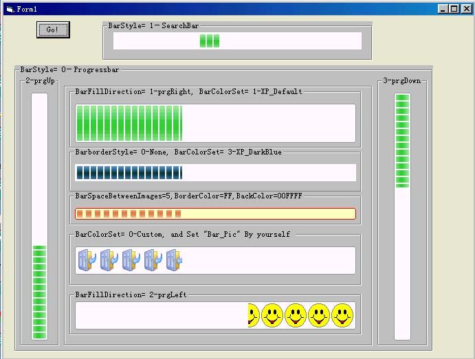



## HzxY ProgressBar Updated 20030105

### Description

XP-like progressbar and searchBar, 4 filling directions, 8 express image effects, custom image supported, "BackColor" and "BorderColor" can be changed, "Border" can be canceled.

NO Timer , NO ImageBox, NO Label, that is HzxY ProgressBar.
 
### More Info
 

             |
---                |---
**Submitted On**   |2003-01-05 16:38:38
**By**             |[Yin Huang](https://github.com/Planet-Source-Code/PSCIndex/blob/master/ByAuthor/yin-huang.md)
**Level**          |Beginner
**User Rating**    |5.0 (20 globes from 4 users)
**Compatibility**  |VB 6\.0
**Category**       |[Custom Controls/ Forms/  Menus](https://github.com/Planet-Source-Code/PSCIndex/blob/master/ByCategory/custom-controls-forms-menus__1-4.md)
**World**          |[Visual Basic](https://github.com/Planet-Source-Code/PSCIndex/blob/master/ByWorld/visual-basic.md)
**Archive File**   |[HzxY\_Progr152465152003\.zip](https://github.com/Planet-Source-Code/yin-huang-hzxy-progressbar-updated-20030105__1-41827/archive/master.zip)

